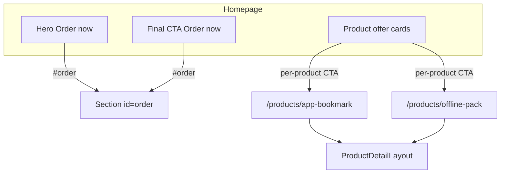

# Commerce specification

Commerce is in **skeleton** phase: product discovery and detail pages exist; **checkout and cart are not implemented**.

## Products (catalog)

Exactly **two** products. Canonical data lives in [`lib/products.ts`](../lib/products.ts).

| ID | Slug | Route | Title | Price |
|----|------|-------|-------|-------|
| `app-bookmark` | `app-bookmark` | `/products/app-bookmark` | 1 Bookmark with App | $12 ($12 per bookmark) |
| `offline-pack` | `offline-pack` | `/products/offline-pack` | 6 Offline Bookmarks | $36 ($6 per bookmark) |

### Product differences (intent)

- **App bookmark:** One bookmark; locate via **free mobile app**; includes spare tracker.
- **Offline pack:** Six bookmarks; **remote tracker works without internet**.

### Shared merchandising

- Offer presentation on homepage is **not duplicated in JSX** — use `ProductOfferCards` reading from `lib/products.ts`.

## User flows

### CTA specification

| Control | Location | Target | Spec |
|---------|----------|--------|------|
| Order now | Hero | `#order` | Scroll to two product cards |
| Order now | Final CTA | `#order` | Same |
| Get Bookmark with App | Offer card | `/products/app-bookmark` | From `product.ctaLabel` |
| Get 6 Offline Bookmarks | Offer card | `/products/offline-pack` | From `product.ctaLabel` |
| Add to cart | PDP | — | **Disabled**; label “Add to cart” |
| View all options | PDP | `/#order` | Return to homepage offer section |
| See also | PDP | `/products/{sibling-slug}` | `RelatedProductCard`: hero image (half card, `object-cover`), title, description, price, `ctaLabel` button |

**Do not** use `mailto:` for primary order CTAs unless this spec is updated.

### Simulated ordering copy

PDP and homepage may state that ordering is a **school-project simulation** and checkout is coming soon. Wording may appear near the disabled cart button and in the final CTA paragraph.

## Product detail page (PDP)

Implemented by [`components/product-detail-layout.tsx`](../components/product-detail-layout.tsx).

### Layout (required elements)

1. Back link → `/`
2. Two columns on `md+`: image | purchase block
3. Purchase block: title, `priceDisplay`, optional `priceDetail`, `shortDescription`
4. **Theme selector** — `<select>` bound to `product.variants` (shared theme list from `productThemes` in `lib/products.ts`)
   - Label: **Theme**
5. **Add to cart** — disabled button
6. **What’s included** — bullet list from `product.features`
7. **See also** — `RelatedProductCard` for sibling product (image, title, `shortDescription`, price, CTA to sibling PDP)
8. **View all options** — `/#order`

### Themes (skeleton)

Both products share the same theme options (alphabetical by label):

| id | Label |
|----|-------|
| `assorted` | Assorted |
| `butterfly-and-insects` | Butterfly and Insects |
| `cute-animals` | Cute Animals |
| `space` | Space |
| `wild-animals` | Wild Animals |

Default selection is the first theme (`assorted`). Theme selection does **not** change price or enable checkout yet. Future spec should define `priceDelta` or SKU mapping before checkout integration.

### Images

Product photos live under `public/assets/products/{slug}/`. Each product has its own set of files; every product includes **`hero.jpg`** for the default image. Other filenames are defined explicitly in `lib/products.ts` (not inferred from the filesystem).

| Field | Use |
|-------|-----|
| `imageSrc`, `imageAlt` | **Hero** only—See also card and any place that shows one product image. Path: `/assets/products/{slug}/hero.jpg`. |
| `galleryImages` | PDP **image gallery** (Amazon-style): large main image + clickable thumbnails. Ordered list in catalog data; first entry must match hero (`imageSrc` / `imageAlt`). Count and filenames differ per product (e.g. app bookmark may include theme sample shots and packaging; offline pack may include only hero and back). |

**PDP gallery behavior:** One large main image; a strip of small thumbnails (vertical column left of main on `md+`, horizontal row below main on small screens). Clicking a thumbnail updates the main image and highlights the active thumb. **Clicking the main image** opens a lightbox (native `<dialog>`) with a larger view; Escape or backdrop click closes it; prev/next controls when multiple images exist. Theme selection does **not** change images.

If `imageSrc` is omitted or `galleryImages` is empty, show a dashed placeholder (“Product image coming soon”).

## Homepage offer cards

[`components/product-offer-cards.tsx`](../components/product-offer-cards.tsx) maps `products` from `lib/products.ts` to two `Card` components with links to `/products/{slug}`.

Each card shows the product **hero** (`imageSrc` / `imageAlt`) on the **left** (half card width, `object-cover`, edge-to-edge) and copy (title, description, price, CTA) on the **right**. No separate mascot beside the cards in the order section.

**Rule:** Do not hardcode prices, product titles, or hero image paths on the homepage offer section; change `lib/products.ts` instead.

## Adding a third product (future)

Requires all of:

1. New record in `lib/products.ts`
2. New `app/products/<slug>/page.tsx`
3. Updates to this spec and [routing-and-pages.md](./routing-and-pages.md)
4. `npm run build` verification

Prefer explicit routes over `[slug]` until catalog size justifies dynamic routing.

## Not implemented

See [roadmap.md](./roadmap.md): cart state, checkout, payments, inventory, variant pricing.
